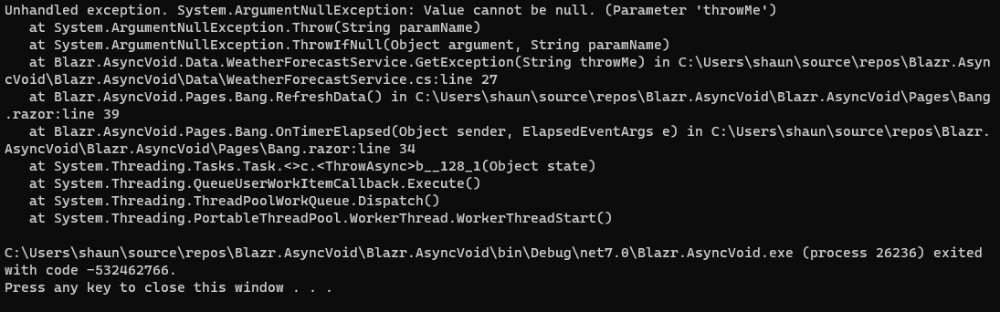

# Handling Async Void in Blazor

Many programmers are unaware of the black hole at the heart of "fire and forget" event handlers that implement the `async void` pattern.  In the synchronous world there's not a problem.  Introduce true asynchronous code (a method or code block that yields) and a black hole appears that you're code can fall into and crash the application.

Here's a simple contrived example using a timer that will crash the application.  Run the application without debugging.

Add a method to `WeatherForecastService` to generate a exception, emulating say a network failure on the provider. 


```csharp
public class WeatherForecastService
{
    //....
    public async Task<IEnumerable<WeatherForecast>> GetException(string? throwMe = null)
    {
        await Task.Yield();
        ArgumentNullException.ThrowIfNull(throwMe);
        return Enumerable.Empty<WeatherForecast>();
    }
}
```

And then a page that refreshes: 

```csharp
@page "/bang"
@inject WeatherForecastService Service
@using System.Timers
@implements IDisposable

<PageTitle>Index</PageTitle>

<h1>Blazor goes Bang!</h1>

<div class="m-2">
    <button disabled="@_timer.Enabled" class="btn btn-success" @onclick=this.Start>Kill Me</button>
</div>

<div class="alert alert-info">
    @this.Message
</div>

@code {
    private System.Timers.Timer _timer = new System.Timers.Timer(2000);
    private string? Message;

    protected override void OnInitialized()
    {
        _timer.AutoReset = true;
        _timer.Elapsed += this.OnTimerElapsed;
    }

    protected void Start()
        => _timer.Enabled = true;

    // This invokes the handler on the UI Dispatcher context
    // and passes the task to the Await extension method on Task
    private async void OnTimerElapsed(object? sender, ElapsedEventArgs e)
        => await this.RefreshData();

    private async Task RefreshData()
    {
        this.Message = DateTime.Now.ToLongTimeString();
        await this.Service.GetException(null);
        await this.InvokeAsync(StateHasChanged);
    }

    public void Dispose()
        => _timer.Elapsed -= this.OnTimerElapsed;
}
```

The result is:



Most instances will crash the SPA session: `<F5>` will reset the application. This one is particularly severe.

## Handling the Error

With any error you need to handle it.  However, an `async void` pattern method is a barrier.  The method is wrapped in a `Task`,  so the calling method (normally an event handler) knows nothing about the `Task`,  and exceptions can't flow up to the caller.  Higher level exception handlers are oblivious to the chaos below.

In the example above, the Timer task is owned by the Scheduler, so the event is run in that context, and the exception bubbles all the way to the top where it crashes the application.

In most cases in Blazor, the exception bubbles up to the Renderer or service container and crashes the session rather than the underlying application.  In a WASM application that is the application. 

The basic rule is: **Handle the exception in the event handler**.

We can write an extension method to help us.  It wraps the task in a `try` and provides two callbacks for success and failure.  It's not the perfect solution because the Task only gets passed to `Await` after it first yields.  Any exceptions raised before this will not be caught by the handler.  The solution is to code a `Task.Yield` as the first line in the actual handler to ensure a yield before any code is run.

```csharp
public static class TaskExtensions
{
    public static async void Await(this Task task, Action? taskSuccess, Action<Exception>? taskFailure)
    {
        try
        {
            await task;
            taskSuccess?.Invoke();
        }
        catch (Exception ex)
        {
            taskFailure?.Invoke(ex);
        }
    }
}
```

We can now use this pattern in our component.  The event handler invokes the actual handler code, separated out into a method, and then calls the `Await` extension method.

```csharp
private void OnTimerElapsed(object? sender, ElapsedEventArgs e)
    => this.InvokeAsync(this.RefreshData)
        .Await(null, this.HandleError);
```

The actual handler method now runs in the Dispatcher context.

```csharp
private async Task RefreshData()
{
    // Yield before we do anything so the Await handler gets any exceptions that are raised
    await Task.Yield();

    this.Message = DateTime.Now.ToLongTimeString();
    await this.Service.GetException(null);
    
    // Call StateHasChanged directly as the method is running in the Dispatcher context
    this.StateHasChanged();
}
```

The full component code.

```csharp
@page "/"
@inject WeatherForecastService Service
@using System.Timers
@implements IDisposable

<PageTitle>Index</PageTitle>

<h1>Hello, world!</h1>

Welcome to your new app.

<div class="m-2">
    <button disabled="@_timer.Enabled" class="btn btn-success" @onclick=this.Start>Start</button>
</div>

<div class="alert alert-info">
    @this.Message
</div>

<div hidden="@(errorMessage is null)" class="alert alert-danger">
    @this.errorMessage
</div>

@code {
    private System.Timers.Timer _timer = new System.Timers.Timer(2000);
    private string? Message;
    private string? errorMessage;

    protected override void OnInitialized()
    {
        _timer.AutoReset = true;
        _timer.Elapsed += this.OnTimerElapsed;
    }

    protected void Start()
        => _timer.Enabled = true;

    private void OnTimerElapsed(object? sender, ElapsedEventArgs e)
        => this.InvokeAsync(this.RefreshData).Await(null, this.HandleError);

    private void HandleError(Exception ex)
    {
        errorMessage = $"{ex.Message} at {DateTime.Now.ToLongTimeString()}";
        this.InvokeAsync(StateHasChanged);
    }

    private async Task RefreshData()
    {
        await Task.Yield();
        this.Message = DateTime.Now.ToLongTimeString();
        await this.Service.GetException(null);
        this.StateHasChanged();
    }

    public void Dispose()
        => _timer.Elapsed -= this.OnTimerElapsed;
}
```

## Service Loading

One common scenario is where you want to load data asynchronously when a class initializes.

This can be achieved like this:

```csharp
public class ScopedService
{
    public Task LoadingTask = Task.CompletedTask;

    public ScopedService()
    {
        this.LoadingTask = this.LoadData();
    }

    public async Task LoadData()
        => await this.LoadCountries();

    public async Task<IEnumerable<string>> GetData()
    {
        // wait for the load task to complete before returning data
        await this.LoadingTask;
        return _countries;
    }

    private async Task LoadCountries()
    {
        await Task.Delay(1000);
        _countries.Clear();
        _countries.Add("UK");
        _countries.Add("France");
        _countries.Add("Portugal");
        _countries.Add("Spain");
        var x = Random.Shared.Next(1, 3);
        if (x == 2)
            throw new Exception("The number can't be 2!!!!");
    }
}
```

However, there no handling of exceptions.  We can improve this using the extension method.  This now catches any exceptions and calls the appropriate callback that can log activity and take any appropriate actions.

```csharp
private ILogger<ScopedService> _logger;

public ScopedService(ILogger<ScopedService> logger)
{
    _logger = logger;
    // start the async task and assign it to LoadingTask
    this.LoadingTask = this.LoadData()
        .Await(this.HandleSuccess, this.HandleFailure);
}

private void HandleFailure(Exception ex)
    => this._logger.LogCritical($"Log the error; {ex.Message}");

private void HandleSuccess()
    => this._logger.LogInformation($"{this.GetType().Name} loaded successfully");

```


